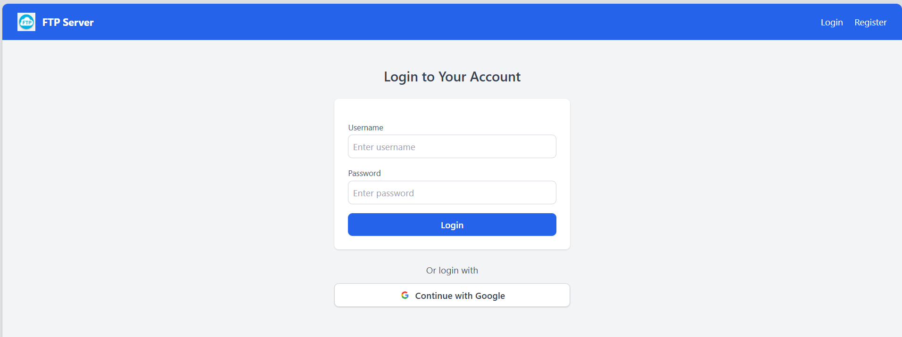
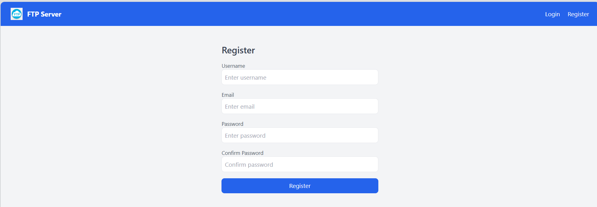
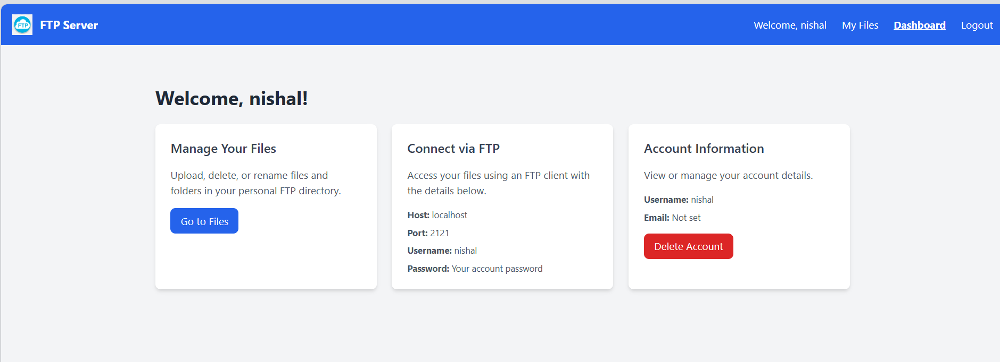
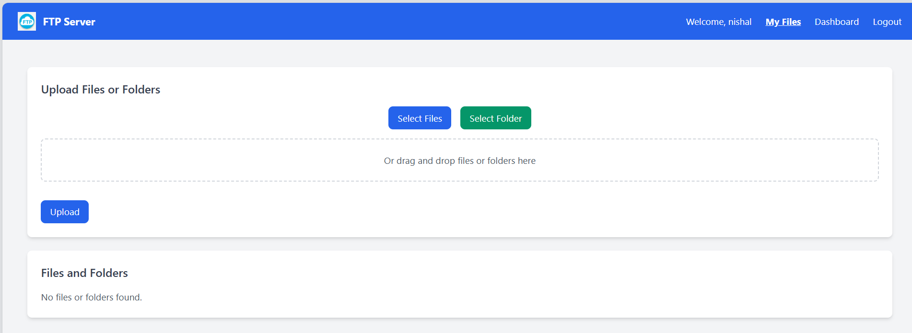
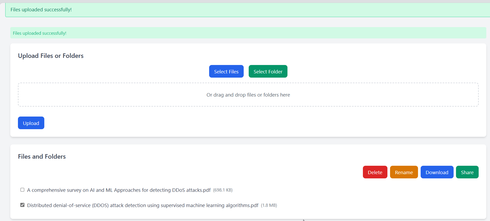
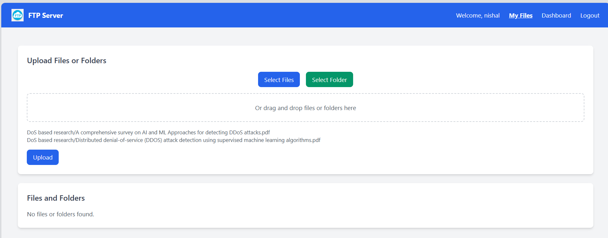
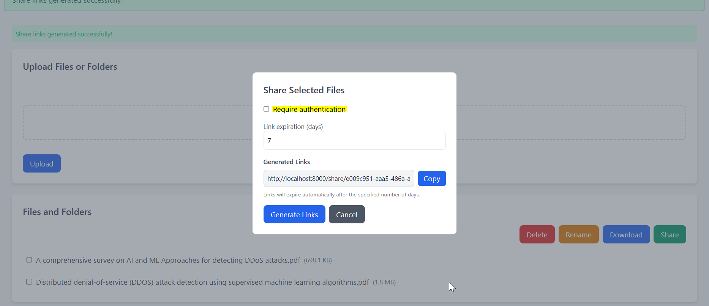
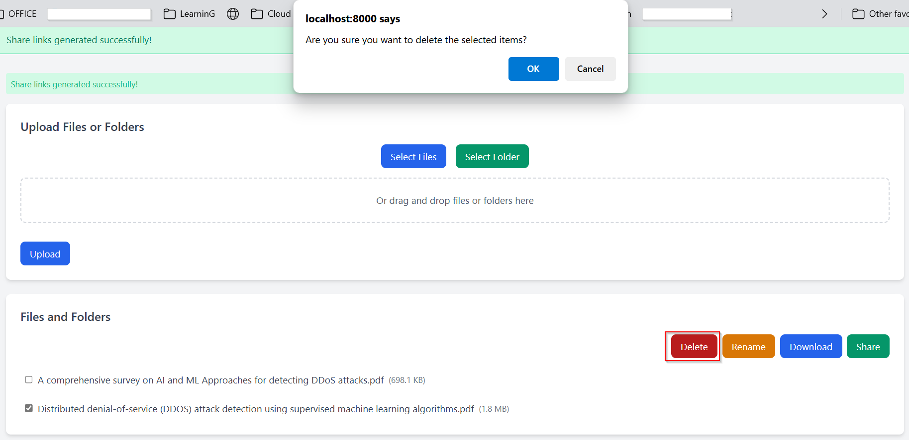

# ftp-with-django
Personal project to explore FTP server functionality and web UI integration using Django.

A web-based FTP file manager built with Django that supports:
- User authentication via Google OAuth
- Secure file upload/download functionality over FTP
- Admin dashboard to manage users and files
- .env-based configuration for secrets and keys
- Remote access to the Django /admin panel is restricted to specific IP addresses for enhanced security

<br>


> ⚠️ This project is a personal learning initiative focused on understanding FTP server interactions in a Django backend and exploring authentication mechanisms.

<br>

---

## 🔧 Features

- Google OAuth 2.0 login (via Django Allauth)
- Secure, role-based access to uploaded files
- Web-based FTP file management
- Admin panel via Django’s built-in admin
- Environment-based secret management (`.env`)
- Drag-and-drop upload support
- Future scope: performance tuning and enhanced FTP features

<br>

## 📁 Project Structure
```
ftp_portal/
├── db.sqlite3
├── ftp_app                     # Main Django app
│   ├── __init__.py
│   ├── __pycache__
│   │   ├── __init__.cpython-310.pyc
│   │   ├── admin.cpython-310.pyc
│   │   ├── apps.cpython-310.pyc
│   │   ├── forms.cpython-310.pyc
│   │   ├── ftp_server.cpython-310.pyc
│   │   ├── models.cpython-310.pyc
│   │   ├── signals.cpython-310.pyc
│   │   ├── urls.cpython-310.pyc
│   │   └── views.cpython-310.pyc
│   ├── admin.py
│   ├── apps.py
│   ├── forms.py
│   ├── ftp_server.py
│   ├── management
│   │   ├── __init__.py
│   │   ├── __pycache__
│   │   │   └── __init__.cpython-310.pyc
│   │   └── commands
│   │       ├── __init__.py
│   │       ├── __pycache__
│   │       │   ├── __init__.cpython-310.pyc
│   │       │   └── create_ftp_users.cpython-310.pyc
│   │       └── create_ftp_users.py
│   ├── middleware
│   │   ├── __init__.py
│   │   ├── __pycache__
│   │   │   ├── __init__.cpython-310.pyc
│   │   │   └── block_remote_admin.cpython-310.pyc
│   │   └── block_remote_admin.py
│   ├── migrations
│   │   ├── 0001_initial.py
│   │   ├── 0002_alter_ftpuser_ftp_directory_sharelink.py
│   │   ├── 0003_alter_ftpuser_ftp_directory.py
│   │   ├── __init__.py
│   │   └── __pycache__
│   │       ├── 0001_initial.cpython-310.pyc
│   │       ├── 0002_alter_ftpuser_ftp_directory_sharelink.cpython-310.pyc
│   │       ├── 0003_alter_ftpuser_ftp_directory.cpython-310.pyc
│   │       └── __init__.cpython-310.pyc
│   ├── models.py
│   ├── signals.py
│   ├── static                      # Static assets (CSS/JS)
│   │   └── ftp_app
│   │       ├── images
│   │       │   ├── google.png
│   │       │   └── logo.webp
│   │       └── js
│   │           └── file-manager.js
│   ├── templates                   # HTML templates
│   │   ├── allauth
│   │   │   └── socialaccount
│   │   │       └── login.html
│   │   ├── base.html
│   │   ├── dashboard.html
│   │   ├── file_list.html
│   │   ├── ftp_app
│   │   │   └── _file_tree.html
│   │   ├── login.html
│   │   └── register.html
│   ├── templatetags
│   │   ├── __init__.py
│   │   ├── __pycache__
│   │   │   ├── __init__.cpython-310.pyc
│   │   │   └── filename_filters.cpython-310.pyc
│   │   └── filename_filters.py
│   ├── tests.py
│   ├── urls.py
│   └── views.py
├── ftp_portal
│   ├── __init__.py
│   ├── __pycache__
│   │   ├── __init__.cpython-310.pyc
│   │   ├── settings.cpython-310.pyc
│   │   ├── urls.cpython-310.pyc
│   │   └── wsgi.cpython-310.pyc
│   ├── asgi.py
│   ├── settings.py
│   ├── urls.py
│   └── wsgi.py
├── manage.py
└── media
    └── ftp
```


## ✅ Prerequisites

- Python 3.8+
- Virtualenv (`pip install virtualenv`)
- Google Developer Console project with OAuth client ID & secret

---

## 🚀 Setup Instructions

### 1. Clone the Repository

```
git clone https://github.com/your-username/ftp-web-ui.git
cd ftp-web-ui
```

### Create and Activate Virtual Environment
```
python3 -m venv venv
source venv/bin/activate
```

### Install Dependencies
`pip install -r requirements.txt`

### Environment Variables
Create a `.env` file in the root directory and add your Google OAuth credentials:

```
SECRET_KEY=your-django-secret-key
GOOGLE_CLIENT_ID=your-google-client-id
GOOGLE_CLIENT_SECRET=your-google-client-secret
```


### Run Migration
`python3 manage.py migrate`

### Create Superuser
`python3 manage.py createsuperuser`

### Running the Server
Go to the `ftp_portal` project
`python3 manage.py runserver`

Visit: http://127.0.0.1:8000/ or http://localhost:8000/

<br>

## 🔐 Google OAuth Login
- Click on "Login with Google" on the login page.
- If it's your first time, authorize the app via Google.
- You will be redirected back with access to your FTP dashboard.

<br>

## ⚙️ To Do / Improvements
- ✅ Basic FTP operations
- 🔐 Enforce stricter FTP access control
- 📊 Performance monitoring & optimization
- 🔒 HTTPS and secure session management
- 📄 Audit logs for user activity
- ☁️ AWS S3 Storage Support

<br>

---

# 📸 Screenshots



<br>

**User Registration**












